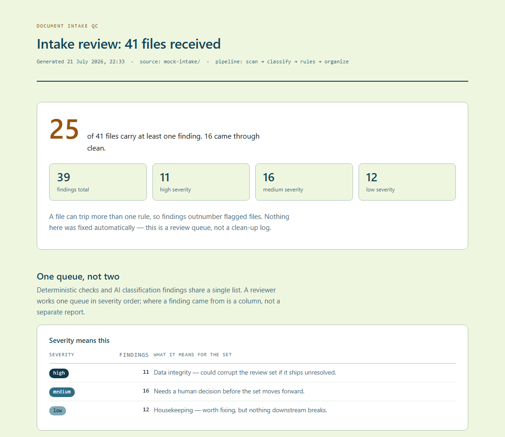

# Document Intake QC Agent

Takes a messy folder of client files, tells you what is wrong with it, and hands back a clean copy — without touching the originals.

One command runs the whole thing on a 41-file mock intake and writes a self-contained HTML report. The classification runs on a local model, so no document leaves the machine and the running cost is $0.



Full report: [docs/qc-report-full.png](docs/qc-report-full.png)

## Run it

```
py scripts/run_demo.py
```

About 45 seconds. It runs seven steps in order and writes `qc-report.html` — open it in any browser, offline.

**After a fresh clone, run `py scripts/make_mock_data.py` first.** Git does not store modification times, so cloning resets the two deliberately impossible dates (1980 and 2031) planted in the fixture. The runner checks for this and warns you, but the fix is to regenerate.

No local model? `py scripts/run_demo.py --no-ai` runs the deterministic half — the rules engine and the author/custodian axes stand alone on a machine with nothing installed.

## What it does

| # | Step | Produces |
|---|---|---|
| 1 | `py scripts/scan.py` | `manifest.csv` — one row per file: true type read from magic bytes, size, SHA-256, dates, embedded author |
| 2 | `py scripts/classify.py` | `classifications.csv` — invoice / contract / correspondence / report / other, from a local model |
| 3 | `py scripts/rules.py` | `exceptions.csv` — twelve checks, one row per (file, rule), each with a severity and a reason |
| 4 | `py scripts/organize.py --by class` | `organized/by-class/` — a non-destructive copy bucketed by what each document is |
| 5 | `py scripts/organize.py --by author` | `organized/by-author/` — bucketed by who wrote it |
| 6 | `py scripts/organize.py --by custodian` | `organized/by-custodian/` — bucketed by where it was collected from |
| 7 | `py scripts/report.py` | `qc-report.html` — the client-facing deliverable |

The order is load-bearing, which is why it lives in [`scripts/run_demo.py`](scripts/run_demo.py) rather than in instructions a reader has to follow correctly. `report.py` must run last, because it reads all three cross-references. Two independent things enforce that: the QC gate fails if the chain is reordered, and `report.py` itself refuses to render when a cross-reference is missing rather than reconciling a partial set against itself.

## Results on the mock intake

| Figure | Value |
|---|---|
| Files received | 41 |
| Files with at least one finding | 25 |
| Files clean | 16 |
| Findings total | 39 |
| High severity | 11 |
| Medium severity | 16 |
| Low severity | 12 |
| Documents classified | 32 |
| Sent to manual review, unlabeled | 9 |
| Date comparisons matching | 246 |

These numbers are not typed in by hand. `scripts/qc_phase5.py` reads this table, recomputes every figure from the live pipeline, and fails if the README and the code disagree.

## What it gets right that a folder sort does not

- **Files are identified by their bytes, not their names.** A PNG wearing a `.jpg` extension and a text file renamed `.pdf` are both caught. Duplicates are found by SHA-256, not by filename.
- **Three questions kept separate.** Who wrote a document, who supplied it, and what it is are three different facts. One contract in this set is named for Acme Supply, written by Dana Cruz of Meridian, and collected from Legal — it files under a different bucket on each axis, and the QC gate asserts those three answers stay different.
- **The model never sees the filename or the folder.** It reads document text only. That keeps the folder as an independent second opinion, so a document filed in the wrong place becomes a finding instead of being confirmed by its own location.
- **It refuses to guess.** Nine files have no readable text — photos, an archive, empty files. They are reported unlabeled rather than given a plausible bucket.
- **Originals are never modified.** The scanner is proven read-only by hashing all 41 files before and after. The organizer refuses to write anywhere inside the source folder.
- **Copies keep their metadata.** Creation dates, modified dates, NTFS permissions and the original folder structure survive the copy, so the impossible-date findings stay true on the delivered set instead of being reset to today.

## What it does not do

Stated here for the same reason the report states them: a client finding out later is worse.

- **Bad filenames are reported, not fixed.** Files are copied under their original names on purpose — a renamed file no longer matches what was collected.
- **Access times are not preserved, and cannot be.** Reading a file to hash it updates its access time, so step 1 destroys the original before any copy exists. If a matter needs them, the collection tool must capture them at acquisition.
- **File ownership is not proven.** The copy engine was tested on a single-user machine, where the check cannot fail.
- **Classification accuracy here does not predict accuracy on your set.** These documents are short and clean. Real intakes bring scans and OCR noise.

## Requirements

- **Python 3.14.5** via the `py` launcher — the version it is built and tested on. Older versions are untested rather than unsupported.
- `pandas`, `pypdf`, `python-docx`, `openpyxl`, `reportlab`, `pillow`
- **Windows** — the copy engine is `robocopy`, chosen because it was the only method measured to preserve creation dates and ACLs. Other platforms fall back to `shutil.copy2`, which loses both.
- **[Ollama](https://ollama.com) running `gemma4:12b`** for the classification step, on `127.0.0.1:11434`. Not needed for `--no-ai`.
- Chrome, only if you re-capture the screenshots with `py scripts/capture_screenshots.py`.

## Repo map

| Path | What it is |
|---|---|
| [`scripts/`](scripts) | The pipeline, plus one QC gate script per phase |
| [`mock-intake/`](mock-intake) | The 41-file test fixture — a deliberately messy client dump |
| [`seeded-errors.md`](seeded-errors.md) | The answer key: 21 planted errors across 9 types |
| [`custodian-map.csv`](custodian-map.csv) | Stands in for a client's collection log |
| [`docs/`](docs) | Committed screenshots of the report |
| [`PLAN.md`](PLAN.md) | Phased plan with the QC gate for each phase |
| [`DECISIONS.md`](DECISIONS.md) | Why each choice was made, and what was rejected |
| [`SOP-DRAFT.md`](SOP-DRAFT.md) | The repeatable client process behind the build |

`manifest.csv`, `exceptions.csv`, `classifications.csv`, `organized/` and `qc-report.html` are generated, so they are not committed. One command rebuilds them.

## How it is tested

Every phase has a QC gate that runs the real pipeline and checks the output against the generated answer key. The fixture and its answer key come from the same script, so they cannot drift apart.

| Gate | Checks | Covers |
|---|---|---|
| `py scripts/qc_phase0.py` | 39 | The fixture itself: every planned error type present |
| `py scripts/qc_phase1.py` | 13 | Inventory reconciles with disk; scan proven read-only |
| `py scripts/qc_phase2.py` | 22 | All 21 planted errors caught, zero false positives |
| `py scripts/qc_phase3.py` | 17 | 32/32 classification accuracy; no invented labels |
| `py scripts/qc_phase4.py` | 131 | Copies byte-identical and metadata-faithful; report figures recomputed independently |
| `py scripts/qc_phase5.py` | 85 | The demo runs from scratch; this README matches the code |

Two rules the gates follow throughout:

**A gate is not trusted until it has been made to fail.** Every claim was disproved in isolation and the break reverted — switching the copy method so creation dates were lost, flattening the folder structure, dropping the permission flag, making the classifier guess a label, inflating one figure in the report. Each produced exactly the failure it should have, and one of those tests exposed a check that was passing for the wrong reason, which was then downgraded rather than kept.

**The gate never asks the code whether it is right.** Report figures are recomputed from the source CSVs and compared against the numbers parsed back out of the rendered HTML. Two routes, one answer — otherwise a single bug agrees with itself.

## Note

All data here is mock data, generated for demonstration. No client files, real names, or real matters appear anywhere in this repository.
